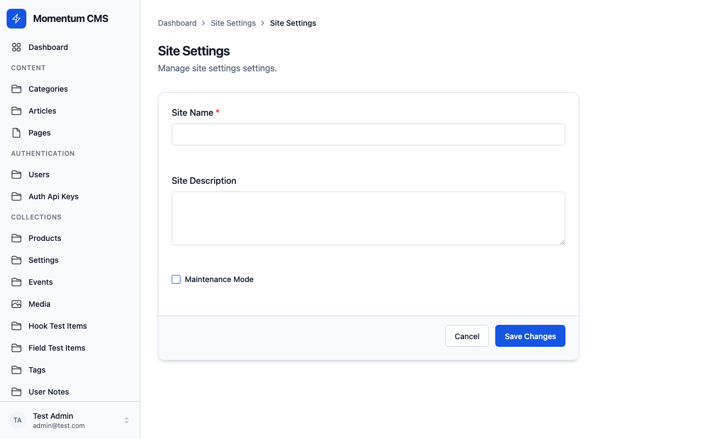

# Globals

Globals are singleton collections — a single document with no list view. Use them for site settings, navigation, or other one-off configuration.



## defineGlobal

```typescript
import { defineGlobal, text, array, group } from '@momentumcms/core';

export const SiteSettings = defineGlobal({
	slug: 'site-settings',
	label: 'Site Settings',

	admin: {
		group: 'Settings',
		description: 'Global site configuration',
	},

	access: {
		read: () => true,
		update: ({ req }) => req.user?.role === 'admin',
	},

	hooks: {
		beforeChange: [],
		afterChange: [],
		beforeRead: [],
		afterRead: [],
	},

	fields: [
		text('siteName', { required: true }),
		text('tagline'),
		group('social', {
			fields: [text('twitter'), text('github')],
		}),
		array('navItems', {
			fields: [text('label', { required: true }), text('url', { required: true })],
		}),
	],
});
```

## How Globals Differ from Collections

| Feature       | Collection     | Global                     |
| ------------- | -------------- | -------------------------- |
| Documents     | Many           | One                        |
| List view     | Yes            | No                         |
| Create/Delete | Yes            | No                         |
| API           | Full CRUD      | Read + Update only         |
| Access        | All operations | `read` and `update` only   |
| Hooks         | All            | Subset (no delete/restore) |

## API Endpoints

| Method | Path                 | Description                |
| ------ | -------------------- | -------------------------- |
| GET    | `/api/globals/:slug` | Get the global document    |
| PATCH  | `/api/globals/:slug` | Update the global document |

## Versioning

Globals support versioning just like collections:

```typescript
export const SiteSettings = defineGlobal({
  slug: 'site-settings',
  versions: true,
  fields: [...],
});
```

## Related

- [Collection Overview](overview.md) — Standard collections
- [REST API](../server/rest-api.md) — API endpoints
