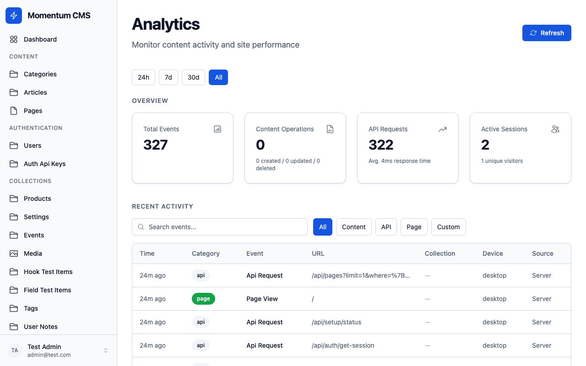
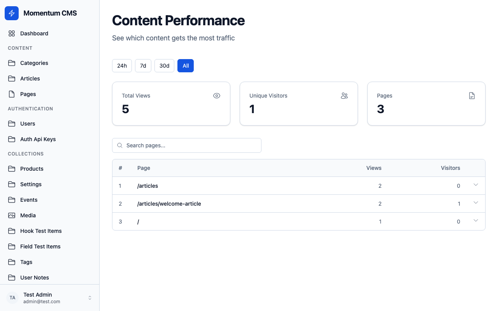
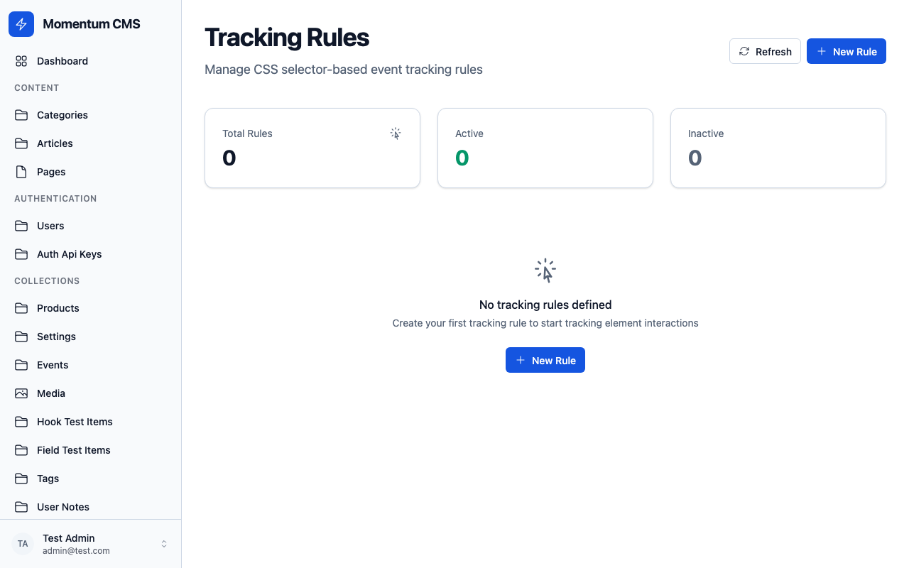

# Analytics Plugin

Track content operations, API usage, page views, and custom events with adapter-based persistence.



## Setup

```typescript
import { analyticsPlugin } from '@momentumcms/plugins/analytics';

export default defineMomentumConfig({
	plugins: [
		analyticsPlugin({
			adapter: myAnalyticsAdapter,
			trackCollections: true,
			trackApi: true,
			blockTracking: true,
			contentPerformance: true,
			trackingRules: true,
		}),
	],
});
```

## Configuration

| Option               | Type               | Default                | Description                          |
| -------------------- | ------------------ | ---------------------- | ------------------------------------ |
| `enabled`            | `boolean`          | `true`                 | Enable/disable plugin                |
| `adapter`            | `AnalyticsAdapter` | required               | Persistence backend                  |
| `trackCollections`   | `boolean`          | `false`                | Track CRUD operations server-side    |
| `trackApi`           | `boolean`          | `false`                | Track API request timing             |
| `trackAdmin`         | `boolean`          | `false`                | Track admin panel actions            |
| `blockTracking`      | `boolean`          | `false`                | Add tracking toggles to block fields |
| `contentPerformance` | `boolean`          | `false`                | Per-document performance metrics     |
| `trackingRules`      | `boolean`          | `false`                | Admin-managed CSS selector tracking  |
| `ingestPath`         | `string`           | `'/analytics/collect'` | Client-side event endpoint           |
| `ingestRateLimit`    | `number`           | `100`                  | Max requests/min per IP              |
| `flushInterval`      | `number`           | `5000`                 | Batch flush interval (ms)            |
| `flushBatchSize`     | `number`           | `100`                  | Events per flush batch               |
| `excludeCollections` | `string[]`         | `[]`                   | Collections to skip tracking         |

## Analytics Adapter

Implement the adapter interface for your persistence backend:

```typescript
interface AnalyticsAdapter {
	store(events: AnalyticsEvent[]): Promise<void>;
	query?(options: AnalyticsQueryOptions): Promise<AnalyticsQueryResult>;
	initialize?(): Promise<void>;
	shutdown?(): Promise<void>;
}
```

## Event Structure

```typescript
interface AnalyticsEvent {
	id: string;
	category: 'admin' | 'api' | 'content' | 'page' | 'action' | 'custom';
	name: string;
	timestamp: string;
	sessionId?: string;
	userId?: string;
	visitorId?: string;
	properties: Record<string, unknown>;
	context: {
		source: 'server' | 'client';
		url?: string;
		referrer?: string;
		userAgent?: string;
		ip?: string;
		collection?: string;
		operation?: string;
		duration?: number;
		statusCode?: number;
	};
}
```

## Features

### Collection Tracking

When `trackCollections: true`, CRUD operations on collections emit events automatically. Use `excludeCollections` to skip noisy collections.

### API Tracking

When `trackApi: true`, API requests are wrapped to capture timing, status codes, and endpoint information.

### Block Tracking

When `blockTracking: true`, block fields get a tracking toggle injected. This allows content editors to enable/disable analytics for individual content blocks.

### Content Performance



When `contentPerformance: true`, per-document metrics are tracked:

```typescript
interface ContentPerformanceData {
	pageViews: number;
	uniqueVisitors: number;
	topReferrers: Array<{ referrer: string; count: number }>;
	blockEngagement?: Array<{ blockType: string; impressions: number; hovers: number }>;
}
```

### Tracking Rules



When `trackingRules: true`, admins can define CSS-selector-based tracking rules:

```typescript
interface TrackingRule {
	id: string;
	name: string;
	selector: string; // CSS selector
	eventType: 'click' | 'submit' | 'scroll-into-view' | 'hover' | 'focus';
	eventName: string; // Custom event name
	urlPattern: string; // Glob pattern
	properties: Record<string, string>; // Static properties
	extractProperties?: PropertyExtraction[]; // Dynamic extraction from DOM
	active: boolean;
	rateLimit?: number; // Events/min per visitor
}
```

## Event Buffering

Events are buffered in memory and flushed in batches for performance:

1. Events accumulate in the `EventStore`
2. Every `flushInterval` ms, buffered events are sent to the adapter
3. On shutdown, remaining events are flushed

## Client-Side Ingestion

The plugin registers an endpoint (default: `/analytics/collect`) for client-side events with IP-based rate limiting.

## Admin Dashboard

When `adminDashboard: true`, the plugin registers admin routes:

| Route                       | Description              |
| --------------------------- | ------------------------ |
| `/analytics`                | Main analytics dashboard |
| `/analytics/content`        | Per-document performance |
| `/analytics/tracking-rules` | Rule management UI       |

## Related

- [Plugins Overview](overview.md) — Plugin system
- [OpenTelemetry](opentelemetry.md) — Tracing integration
